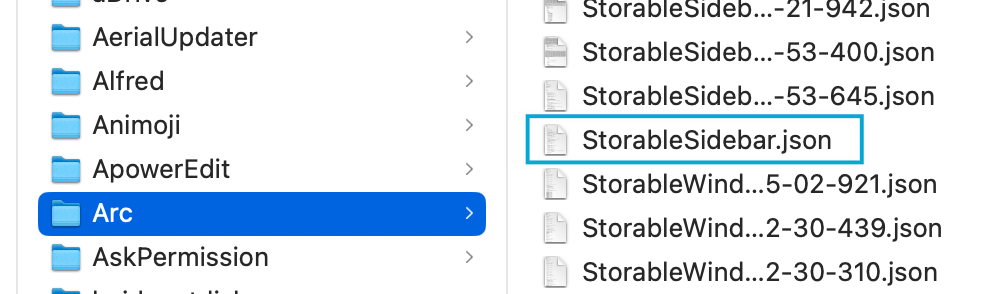

# Export Arc browser bookmarks

You can use this project to export Arc browser bookmarks easily.

## How to use?

### Environment Preparation

Arc browser

### Find `StorableSidebar.json`

1. Enter arc://version in the Arc address bar

2. Determine the data storage path by `profile` path for Arc

3. Navigate to the Arc browser folder via Finder: such as `/Users/vincentliu/Library/Application Support/Arc`

4. Copy `StorableSidebar.json` to somewhere that you can easily find

5. Please navigate to https://xiaogliu.github.io/export-arc-bookmarks and upload your Arc 'StorableSidebar.json' file. Once done, you will receive an 'arcBookmarks.html' file. This is a standard bookmark file that can be imported into browsers such as Chrome, Edge, Safari, Firefox, etc

## Which versions have verified?

### MacOS

- Version 1.36.0 (48035), Chromium Engine Version 123.0.6312.87

## Declaration

All Bookmarks are handled locally in your browser, and are not transmitted to any cloud server, please feel free to use.

## License

MIT
