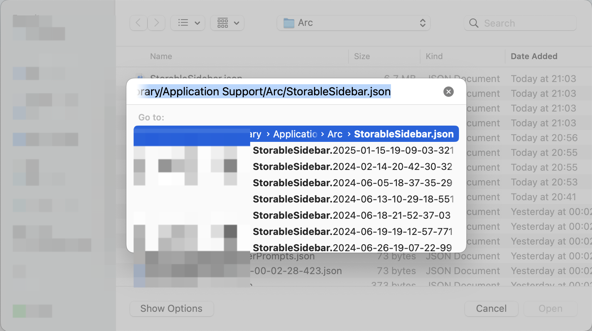
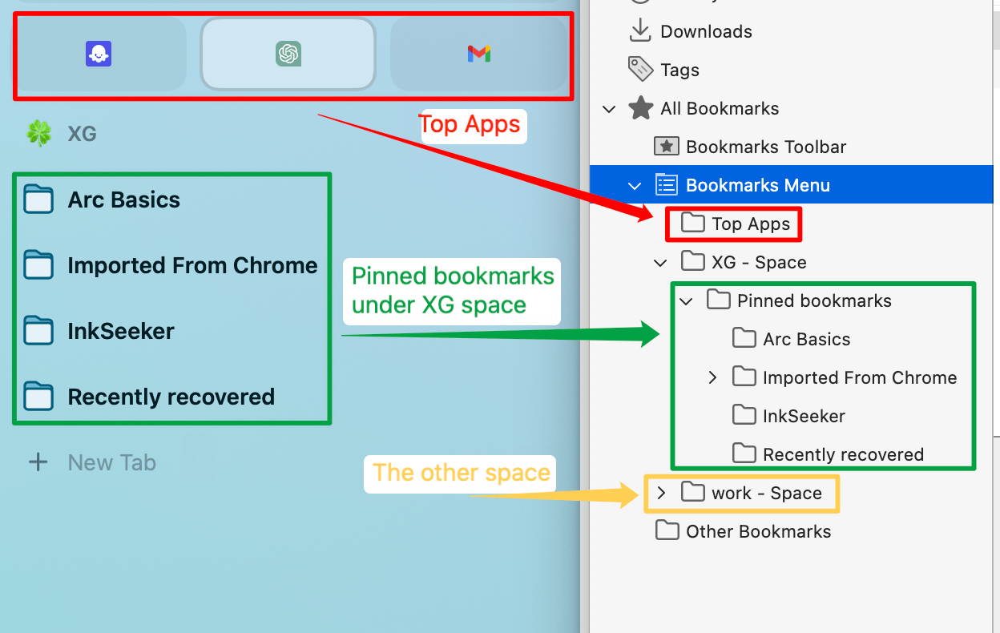
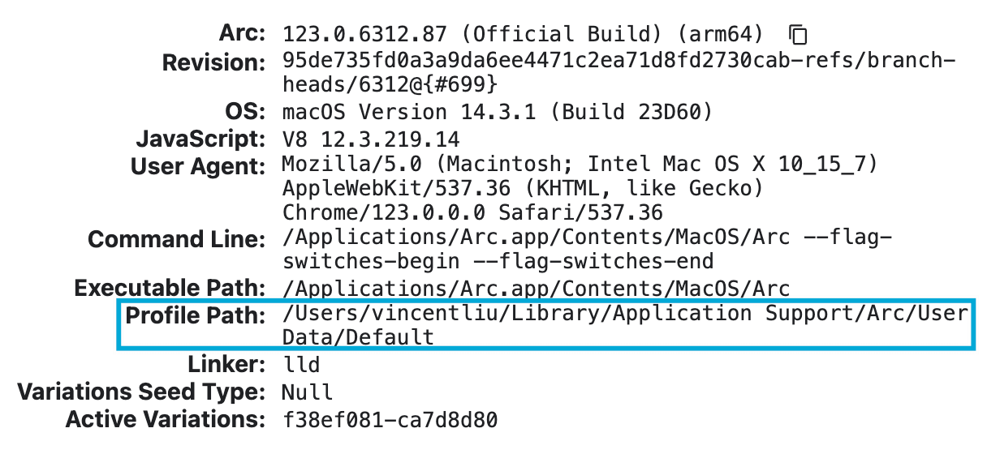

# Export Arc browser bookmarks

You can use this project to export Arc browser bookmarks easily.

## How to use?

### Environment Preparation

Arc browser

### Let's go

1. Navigate to https://xiaogliu.github.io/export-arc-bookmarks
2. Click `Choose File 📁`, it will open Finder
3. Press `⌘⇧G` in Finder to open `Go to the folder` dialog
4. Type `~/Library/Application Support/Arc/StorableSidebar.json` in Finder dialog
5. Press `Enter` to locate the bookmark file
   

6. Press `Enter` again to select the `StorableSidebar.json` file. Once done, you will receive an `arcBookmarks.html` file. This is a standard bookmark file that can be imported into browsers such as Chrome, Edge, Safari, Firefox, etc
   

## Which versions have been verified? (Under MacOS)

#### Arc browser

- Version 1.36.0 (48035), Chromium Engine Version 123.0.6312.87
- Version 1.37.0 (48361), Chromium Engine Version 123.0.6312.106
- Version 1.79.1 (58230), Chromium Engine Version 132.0.6834.160

#### Firefox browser

- 134.0.2 (aarch64)

## ⚠️ Warning

1. I only tested on macOS, if you are using Windows or Linux, you may need to find the bookmark file manually by input `arc://version` in the Arc address bar and find the bookmark data storage path by `Profile Path`"
   

2. I tested on 2025-02-02, Chrome/Safari seems only can import the first space. I won't spend too much time debugging for now. Because I tested that Firefox works normally, so you can do this:
   a. Import the exported Arc bookmarks into Firefox
   b. Export bookmarks through Firefox
   c. Import the bookmarks exported by Firefox into your browser

3. If you have a large number of bookmarks, it may cause the program to crash. Please try several times.

## Declaration

All Bookmarks are handled locally in your browser, and are not transmitted to any cloud server, please feel free to use.

## License

MIT
